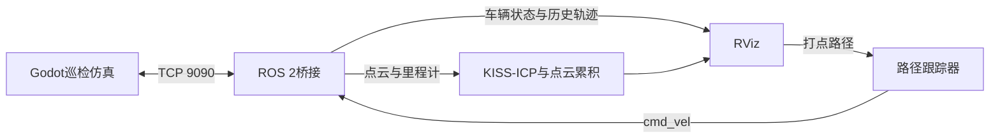
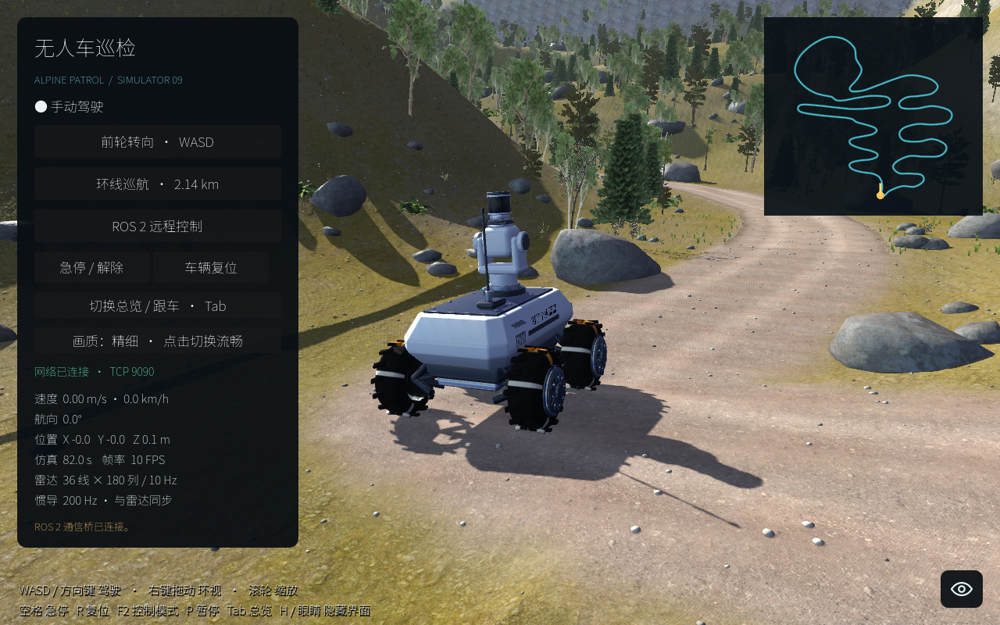

# 无人车巡检仿真 · patrol_sim

**patrol_sim 是一个基于 Godot 和 ROS 2 的三维无人车巡检仿真项目**，用于在山地道路环境中调试车辆控制、传感器接口、点云建图和路径跟踪。

项目包含阿克曼转向巡检车、36线激光雷达、IMU、相机和里程计，可在 RViz 中查看车辆、点云与历史轨迹，并通过打点插件发布路径，让车辆跟踪行驶。仿真以 **Linux 独立窗口**运行，支持键盘驾驶和 ROS 2 控制。

GitHub 保存仿真与 ROS 2 源码；Linux运行程序、模型和贴图通过百度网盘提供。当前资源版本为 **v0.1.0**。

## 1. 下载与安装

### 1.1 下载 GitHub 源码

推荐环境：Ubuntu 22.04 x86_64，有图形桌面和可用的 OpenGL 驱动。仅运行仿真无需安装 ROS 2、Godot 编辑器或 Node.js；使用 ROS 功能时按下文安装 Humble。

下面统一以 `~/projects/patrol_sim` 为项目目录，以 `~/Downloads` 为下载目录：

```bash
# 如果尚未安装 Git 和 unzip
sudo apt update
sudo apt install git unzip

mkdir -p "$HOME/projects"
cd "$HOME/projects"
git clone https://github.com/Ming2zun/patrol_sim.git
cd patrol_sim
```

也可以在 GitHub 点击 **Code → Download ZIP**，解压后进入包含 `README.md`、`VERSION`、`start_sim.sh` 的目录。该目录就是下文的“项目根目录”；名称可能是 `patrol_sim-main`，不影响脚本运行。

### 1.2 下载百度网盘资源

**[点击下载资源包](https://pan.baidu.com/s/1y2tUdUTatbT0SCpA33OZ3w?pwd=ig4c) · 提取码：`ig4c`**

下载文件：`patrol_sim-v0.1.0-运行与开发资源.zip`，约 **440 MiB**。

先把这个ZIP下载到 `~/Downloads`，再解压到同一位置：

```bash
unzip "$HOME/Downloads/patrol_sim-v0.1.0-运行与开发资源.zip" -d "$HOME/Downloads"
```

也可以用文件管理器右键解压。解压完成后应能找到：

```text
~/Downloads/patrol_sim-v0.1.0-运行与开发资源/
├── 下载后先看.txt
├── patrol_sim-v0.1.0-runtime-linux-x86_64.tar.gz
├── patrol_sim-v0.1.0-godot-assets.tar.gz
└── SHA256SUMS.txt
```

**这个下载文件夹留在 Downloads 就可以，不需要手动搬到源码目录。** 如果解压软件又套了一层同名文件夹，下一步应选择直接包含两个 `.tar.gz` 和 `SHA256SUMS.txt` 的那一层。

### 1.3 自动安装到项目

在GitHub源码的项目根目录执行：

```bash
cd "$HOME/projects/patrol_sim"
bash scripts/install_resources.sh "$HOME/Downloads/patrol_sim-v0.1.0-运行与开发资源"
```

脚本先检查版本和SHA256，再自动解压到项目中的固定位置：

| 资源包 | 自动安装位置 | 用途 |
|---|---|---|
| `runtime-linux-x86_64.tar.gz` | `simulation/runtime/` | 直接运行仿真必需，约220 MiB压缩包 |
| `godot-assets.tar.gz` | `simulation/godot/assets/` | 修改模型、场景和编辑器导出需要，约219 MiB压缩包 |

安装后完整项目应为：

```text
~/projects/patrol_sim/
├── README.md
├── VERSION
├── start_sim.sh
├── start_ros2.sh
├── scripts/
├── simulation/
│   ├── godot/
│   │   ├── project.godot                # GitHub提供
│   │   ├── scripts/                     # GitHub提供
│   │   └── assets/                      # 从网盘素材包安装
│   └── runtime/
│       ├── start.sh                     # GitHub提供
│       ├── sim_config.json              # GitHub提供
│       ├── AlpinePatrol.x86_64           # 从网盘运行包安装
│       └── AlpinePatrol.pck              # 从网盘运行包安装
└── ros2/
    └── src/                             # GitHub提供
```

不要把压缩包直接放进 `ros2/`，也不要在 `simulation/` 内再次解压。脚本按自身位置定位项目，因此项目可以存放在其他目录；只需相应修改上面的 `cd` 和下载文件夹参数。

默认安装两份资源。只运行仿真时也可以仅把运行包和校验文件放到另一个文件夹，再将其传给安装脚本。安装会覆盖对应资源，修改过模型或程序请先备份。

## 2. 运行仿真

需要 x86_64 Linux 图形桌面和可用的 OpenGL 驱动；在 Ubuntu 22.04 / Intel 集成显卡上测试。不需要 Node.js、浏览器、ROS 2、Blender 或 Godot 编辑器。

```bash
chmod +x start_sim.sh simulation/runtime/start.sh simulation/runtime/AlpinePatrol.x86_64
./start_sim.sh
```

程序打开独立窗口。关闭窗口或终端按 Ctrl+C 停止。

- W/S 或方向键：前进、后退；A/D：转向。
- 空格：急停/解除；R：复位；P：暂停；F2：手动/ROS 控制。
- Tab：总览/跟车；右键拖动：环绕视角；滚轮：缩放。
- H 或眼睛按钮：显示/隐藏界面。
- 默认**精细画质**，界面可切换流畅模式。点云目标10 Hz，物理/IMU目标200 Hz；精细画质下集显可能明显卡顿，显示频率、仿真时间频率和现实时间频率不是同一个指标。

## 3. 运行 ROS 2、建图和 RViz

### 安装依赖

先按 [ROS 2 Humble 官方安装说明](https://docs.ros.org/en/humble/Installation/Ubuntu-Install-Debs.html)安装 **ROS 2 Humble Desktop**，再安装构建依赖：

```bash
sudo apt update
sudo apt install python3-colcon-common-extensions python3-pytest python3-numpy python3-yaml \
  build-essential cmake qtbase5-dev libeigen3-dev libtbb-dev libfmt-dev nlohmann-json3-dev
```

本项目携带 KISS-ICP 及必要头文件，不需要另行安装 LIO-SAM/GTSAM，也不需要棉田项目的 build/install 或 ROS overlay。

### 首次编译和启动

在项目根目录执行：

```bash
./scripts/build_ros2.sh
./start_ros2.sh
```

启动脚本会启动仿真、桥接、KISS-ICP、点云累积、车辆显示、历史轨迹、路径跟踪和 RViz。若 TCP 9090 已有仿真，则连接已有实例。启动脚本按 ROS 域加锁，重复运行会提示已有服务；不要手动另启第二个桥接，仿真只接受一个连接。

```bash
./start_ros2.sh --build     # 修改 ROS 代码后重新编译再启动
./start_ros2.sh --no-rviz   # 启动 ROS，省去 RViz 窗口
```

Ctrl+C 会关闭该脚本启动的进程；脚本接入的已有仿真窗口保留。

### ROS 环境

```bash
source ros2/env.sh
ros2 topic list
```

默认 **ROS_DOMAIN_ID=89**、只允许本机 DDS，避免与其他项目混用。需要改域时，在启动脚本及其他 ROS 终端统一设置 `ALPINE_ROS_DOMAIN_ID`。所有定位、建图、RViz 节点使用 `use_sim_time=true` 和 `/clock`。

仿真与桥接通过 TCP 9090 通信，默认本机127.0.0.1。跨电脑使用时，应同时调整 `simulation/runtime/sim_config.json` 的监听地址与 `ros2/src/godot_ros2_bridge/config/bridge.yaml` 的 host；两端 port、token 必须一致。不要在公开网络使用交付包的示例 token。

## 4. 项目详细介绍

### 系统组成

- **三维仿真**：Godot场景提供山地道路、植被、岩石及巡检车辆，支持精细/流畅画质、跟车/总览视角、地图预览和界面隐藏。
- **车辆控制**：阿克曼转向模型，支持手动驾驶、预设环线巡航、ROS远程控制；没有原地旋转能力。
- **传感器**：36线激光雷达目标10 Hz、IMU目标200 Hz，以及相机和仿真真值里程计；实际墙钟频率受机器性能影响。
- **ROS桥接**：TCP双向传输仿真状态与控制指令，支持急停、暂停、复位、断连与指令超时处理。
- **建图与显示**：KISS-ICP使用仿真里程计先验，输出地图坐标下点云；累积地图保留周围80米，RViz显示车体和实际历史轨迹。
- **路径跟踪**：RViz LineDraw插件发布规划路径，跟踪器生成 `/cmd_vel`，仿真将速度和角速度转换为车辆转向与运动。



### RViz 操作

Fixed Frame 为 `map`，左侧 Displays 包含：

- **历史行驶轨迹**：`/sim/trajectory`，橙色，记录车辆实际位置，包含高度；与规划路径及 ICP 轨迹独立。位移不足0.05米时不追加，最多10000点，最多5 Hz刷新，暂停/停车不会无限堆积。复位或仿真时钟回退会清空，新打开的 RViz 可收到缓存路径。
- **Planned path**：下发给跟踪器的路径。
- **ICP trajectory**：KISS-ICP 输出的轨迹。
- **Accumulated map (80 m)**：车辆周围80米的累积点云，0.25米体素，1 Hz刷新。
- **MarkerArray**：车体、轮子和传感器示意，不包含地面立方体。

清空历史显示，不影响控制路径：

```bash
ros2 service call /sim/trajectory/clear std_srvs/srv/Trigger '{}'
```

使用 LineDraw 面板 **打点 → 连续左键选点 → 发布** 启动跟踪；**清除**取消路径并停车。默认速度1m/s，阿克曼曲率受限，圆角最小3米；不发原地旋转指令。也可以：

```bash
ros2 service call /sim/path/clear std_srvs/srv/Trigger '{}'
```

打点插件仍基于 map 水平面，不是山地路径规划器；没有路径贴地、可通行判断或自动绕障。先在附近平坦路段测试。急停、暂停、断连、复位会中止当前跟踪，需要重新发布路径。

## 5. 话题和坐标

| 话题 | 消息类型 | 含义 |
|---|---|---|
| `/cmd_vel` | geometry_msgs/Twist | linear.x 前进速度，angular.z 转弯角速度 |
| `/points_lio` | sensor_msgs/PointCloud2 | 去除无回波点的36线点云，目标10Hz |
| `/imu/data` | sensor_msgs/Imu | 比力、角速度和理想姿态，目标200Hz |
| `/camera/image_raw/compressed` | sensor_msgs/CompressedImage | JPEG 相机图像，频率受渲染负载影响 |
| `/sim/localization/odom` | nav_msgs/Odometry | 仿真真值里程计，map → base_link |
| `/sim/slam/odom` | nav_msgs/Odometry | 定位先验辅助的ICP输出 |
| `/sim/slam/registered_points` | sensor_msgs/PointCloud2 | 已变换到map的当前扫描 |
| `/sim/segmentation/accumulated_points` | sensor_msgs/PointCloud2 | 80米范围的累积体素点云 |
| `/sim/trajectory` | nav_msgs/Path | 实际行驶历史 |
| `/sim/path` | nav_msgs/Path | 跟踪器接受的规划路径 |
| `/sim/slam/path` | nav_msgs/Path | ICP历史 |
| `/clock` | rosgraph_msgs/Clock | 仿真时钟 |

二维 `/scan` 已移除；`/points_raw` 默认关闭，可通过桥接参数 `publish_raw_points: true` 开启调试。`/points_lio` 是传感器扫描，不是已经建好的地图。

ROS 使用 X前、Y左、Z上；Godot → ROS 为 `[-z, -x, y]`。雷达与虚拟IMU相对base_link的位置均为 `[0.335, 0, 2.55]`米。相机使用光学坐标系。不要沿用棉田项目的坐标转换公式。

## 6. 目录和开发

```text
simulation/
  godot/           # 仿真脚本、场景入口、着色器、配置
    assets/        # 单独下载，Git忽略
  runtime/         # Linux启动脚本、运行配置；二进制/PCK单独下载
ros2/
  src/
    godot_ros2_bridge/  # TCP桥接、轨迹、显示、路径跟踪与launch/rviz
    alpine_sim_slam/    # KISS-ICP及vendor
    test_c/            # RViz LineDraw插件
  env.sh
start_sim.sh
start_ros2.sh
scripts/
  build_ros2.sh
  build_sim.sh
  install_resources.sh
  install_resources.py
  package_release.py
  repack_runtime.py
VERSION
docs/
```

- 改 ROS 节点：编辑 `ros2/src/`，运行 `./start_ros2.sh --build`。
- 改仿真脚本/场景：安装匹配的 Godot 4.7.2 编辑器与导出模板，解压素材包，导入 `simulation/godot/project.godot`。Linux 导出预设不要保留其他机器的自定义模板路径。
- 当前 main.gd/minimap.gd 可用 `./scripts/build_sim.sh` 覆盖到已有运行包；仅支持此未加密 Godot PCK v4，不重新导入模型。改其他脚本、新增资源或模型后，请使用编辑器正式导出。
- 编辑器配置：`simulation/godot/config/sim.json`；导出程序配置：`simulation/runtime/sim_config.json`。修改传感器安装位置时同步桥接和SLAM外参。

运行回归测试：

```bash
source ros2/env.sh
PYTEST_DISABLE_PLUGIN_AUTOLOAD=1 python3 -m pytest ros2/src/godot_ros2_bridge/test -q
```

## 7. 算法边界和许可

当前从棉田项目移植的 KISS-ICP **使用仿真真值里程计作为先验**，没有真实RTK输入，不是独立激光SLAM；没有回环与全局位姿图优化。IMU和相机虽然发布，但此KISS后端不融合它们。ICP只做有界局部修正，车辆TF由桥接单独发布，避免冲突。保留山地高差，不使用棉田的绝对Z=0.15米地面裁剪。

仿真传感器和车辆模型尚未实车标定。说明和许可分别见 [移植说明](ros2/src/godot_ros2_bridge/PORTING_NOTES.md)、[许可与素材来源](THIRD_PARTY_NOTICES.md)、[Apache-2.0](LICENSE)。保留各文件和第三方组件原有 MIT、BSD、OFL、CC0 等声明，不用顶层许可证替代第三方条款。

## 8. 打包发布

开发只修改当前项目目录；上一级 `releases/` 是自动生成的发布快照，`archive/` 是旧项目及历史包备份，两者不进入 GitHub。

```bash
git add .
python3 scripts/package_release.py
```

版本号来自根目录 `VERSION`。工具在上一级生成：

```text
releases/v0.1.0/
├── github/
│   └── patrol_sim/                         # 上传里面的全部内容到GitHub仓库根目录
├── patrol_sim-v0.1.0-运行与开发资源/        # 打包为同名ZIP上传百度网盘
│   ├── 下载后先看.txt
│   ├── patrol_sim-v0.1.0-runtime-linux-x86_64.tar.gz
│   ├── patrol_sim-v0.1.0-godot-assets.tar.gz
│   └── SHA256SUMS.txt
└── 上传说明.txt
```

源码快照排除二进制、模型贴图、ROS构建缓存和Codex配置。资源包包含下载说明、校验文件和固定相对路径；将资源文件夹压成同名ZIP上传网盘，上传完成后把ZIP分享链接与提取码补到本文开头，再同步 GitHub 的 README。

已有同版本发布目录时，工具会停止，避免混入旧文件；请先归档旧发布目录，或更新 `VERSION` 并同步文档中的版本。源码按Git暂存的文件列表读取工作区当前内容。运行包使用当前PCK，修改仿真后应先正式导出或执行 `./scripts/build_sim.sh`。

内部Godot导出程序仍使用 `AlpinePatrol.x86_64` 和同名PCK，两者配套；下载包与启动脚本已统一封装，用户无需重命名引擎文件。ROS包名和话题名保留现有接口。

## 9. 运行截图

以下为本项目在Linux上的实际运行截图。

### 三维巡检仿真



